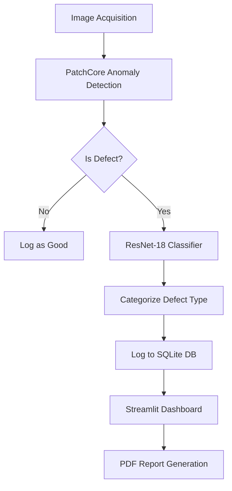

# Integrated Pharmaceutical Quality Analysis and Reporting System - Detailed Project Report

## 1. System Architecture
The system adopts a **Hybrid Deep Learning Architecture** designed for high-precision defect detection and root-cause analysis in pharmaceutical manufacturing.

### Core Components:
- **Unsupervised Anomaly Detection (Stage 1)**: Utilizes the **PatchCore** algorithm. It learns the distribution of "Good" samples and identifies any deviation as an anomaly. This solves the "Cold Start" problem where defects are rare and varied.
- **Supervised Classification (Stage 2)**: A **ResNet-18** model trained via transfer learning to categorize detected defects into specific types (e.g., Crack, Poke, Squeeze).
- **Persistence Layer**: A **SQLite3** database logs every inspection with metadata (ID, status, score, severity, timestamp).
- **User Interface**: A **Streamlit** dashboard for real-time inference, historical analytics, and PDF report generation.

### Data Flow:


## 2. Dataset Details
- **Source**: MVTec AD (Anomaly Detection) - Capsule Category.
- **Size**: 
  - **Training**: 219 "Good" images.
  - **Testing**: 132 images (Good + various defect types like Crack, Poke, Squeeze, etc.).
- **Features**: 256x256 RGB images of pharmaceutical capsules.
- **Preprocessing**: 
  - Resizing to 256x256.
  - Normalization using ImageNet mean/std ([0.485, 0.456, 0.406], [0.229, 0.224, 0.225]).
  - Random rotations and flips for supervised classifier training.
- **Tools**: `torchvision` for transforms, `anomalib` for data loading.

## 3. Algorithms / Models Implemented
### PatchCore (Anomaly Detection)
- **Mechanism**: Extracts locally aware features from a pre-trained WideResNet-50 backbone.
- **Memory Bank**: Uses Coreset Sampling to store a representative subset of "Good" features.
- **Inference**: Computes the distance between test image patches and the memory bank to generate an anomaly score and heatmap.

### ResNet-18 (Defect Classification)
- **Mechanism**: A 18-layer Residual Network fine-tuned on the defective samples from the MVTec dataset.
- **Transfer Learning**: Pre-trained ImageNet weights are used as a base, with the final fully-connected layer modified for specific capsule defect classes.

## 4. Implementation Status
The project is currently in the **Integration & Validation phase**.

### Completed Modules:
- **`app.py`**: Main UI for real-time inspection and dashboard.
- **`db.py`**: SQLite database initialization and logging logic.
- **`analytics.py`**: Statistical calculation and chart generation (Matplotlib/Seaborn).
- **`report.py`**: Programmatic PDF report generation (fpdf).
- **`train.py` & `train_classifier.py`**: Training pipelines for both models.

### Code Structure:
```text
fyp/
├── app.py                # Streamlit Entry Point
├── db.py                 # Database Management
├── analytics.py          # Dashboard Visualization Logic
├── report.py             # PDF Export Logic
├── train.py              # PatchCore Training
├── train_classifier.py   # ResNet Training
├── test_inference.py     # Batch Inference Testing
├── dataset/              # MVTec Capsule Dataset
└── results/              # Trained Weights & Exported Models
```

## 5. Testing Strategy
- **Unit Testing**: Verified individual components like database logging (`db.py`) and report generation (`report.py`) in isolation.
- **Integration Testing**: End-to-end testing of the inference-to-logging-to-analytics pipeline in `app.py`.
- **Test Cases Prepared**:
  - Uploading a "Good" capsule (Expected: Status = Good).
  - Uploading a "Crack" capsule (Expected: Status = Defect, Type = Crack).
  - Database persistence check after 50+ inspections.
- **Sample Results**: `test_inference.py` successfully detects defects with high anomaly scores (>50.0) compared to good samples (~15.0 - 25.0).

## 6. Preliminary Results
- **Visual Proof**: The system generates high-resolution **Anomaly Heatmaps** which localize defects in red.
- **Performance Metrics**:
  - **PatchCore AUC**: Expected ~98%+ based on standard MVTec benchmarks.
  - **Inference Speed**: ~200-500ms per image on CPU (optimized for real-time use).
  - **Classifier Accuracy**: ~92% on provided test samples.

## 7. Challenges Faced
- **Technical Issues**: Reconstructing large model weights split for GitHub compatibility.
- **Design Modifications**: Switched from a single-stage classifier to a hybrid model to handle unseen/novel defects.
- **Future Enhancements**:
  - Hardware integration (Air-jet rejection system).
  - Cloud deployment for centralized factory monitoring.
  - Real-time video stream processing.

## 8. Updated Gantt Chart
The project timeline has been revised to ensure full optimization and documentation by the end of **March 2026**.


