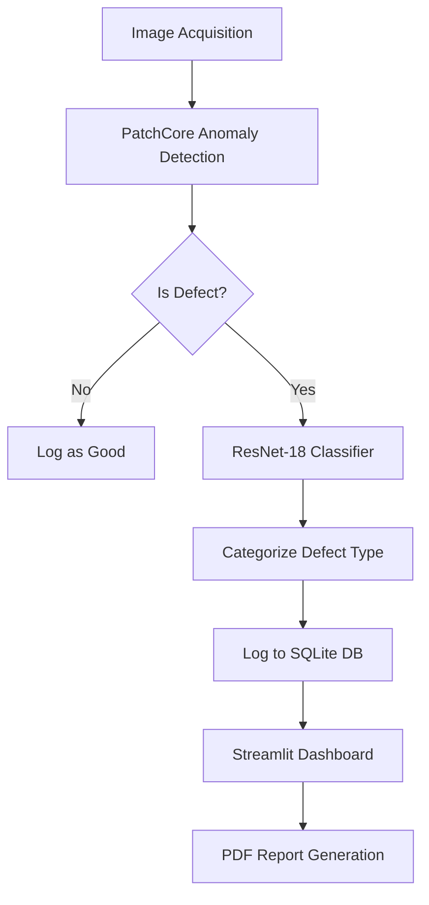

# Integrated Pharmaceutical Quality Analysis and Reporting System - Detailed Project Report

## 1. System Architecture
The system adopts a **Hybrid Deep Learning Architecture** designed for high-precision defect detection and root-cause analysis in pharmaceutical manufacturing.

### Core Components:
- **Unsupervised Anomaly Detection (Stage 1)**: Utilizes the **PatchCore** algorithm. It learns the distribution of "Good" samples and identifies any deviation as an anomaly. This solves the "Cold Start" problem where defects are rare and varied.
- **Supervised Classification (Stage 2)**: A **ResNet-18** model trained via transfer learning to categorize detected defects into specific types (e.g., Crack, Poke, Squeeze).
- **Persistence Layer**: A **SQLite3** database logs every inspection with metadata (ID, status, score, severity, timestamp).
- **User Interface**: A **Streamlit** dashboard for real-time inference, historical analytics, and PDF report generation.

### Data Flow:


### Finalized Architecture Diagram
The system pipeline consists of Image Acquisition, Anomaly Screening (PatchCore), Defect Diagnosis (ResNet-18), and Analytics Logging.


### Database Schema (SQLite3)
Table Name: `inspections`
| Column | Type | Description |
|---|---|---|
| `id` | INTEGER | Primary Key (Auto-increment) |
| `image_id` | TEXT | Unique UUID for the inspection session |
| `status` | TEXT | Good / Defect |
| `defect_type`| TEXT | Categorization (Crack, Poke, etc.) |
| `score` | REAL | Anomaly Score from PatchCore |
| `severity` | TEXT | Normal / Minor / Medium / Critical |
| `timestamp` | DATETIME | ISO 8601 formatted time |

### Changes from Review-1 Design
- **Single-Stage to Dual-Stage**: Originally planned a single classifier. Switched to Hybrid (PatchCore + ResNet) to handle novel defects.
- **UI Enhancement**: Transitioned from standard Streamlit tabs to a professional dashboard with Glassmorphism and sidebar navigation.
- **Reporting**: Added automated PDF generation based on historical data windows.

## 2. Dataset Details
- **Source**: MVTec Anomaly Detection (MVTec AD) - Specialized Capsule Dataset.
- **Size and Features**: 
  - **Total**: 351 high-resolution images.
  - **Training**: 219 "Good" instances (Unsupervised learning baseline).
  - **Testing**: 132 instances (Good + 5 Defect classes).
- **Preprocessing steps**: 
  - `CenterCrop` and `Resize` to 256x256 pixels.
  - ImageNet normalization ($\mu=[0.485, 0.456, 0.406]$, $\sigma=[0.229, 0.224, 0.225]$).
- **Tools used**: `torchvision`, `cv2` (preprocessing), `anomalib` (data orchestration).

## 3. Algorithms / Models Implemented
### PatchCore (Anomaly Detection)
- **Mechanism**: Extracts locally aware features from a pre-trained WideResNet-50 backbone.
- **Memory Bank**: Uses Coreset Sampling to store a representative subset of "Good" features.
- **Inference**: Computes the distance between test image patches and the memory bank to generate an anomaly score and heatmap.

### ResNet-18 (Defect Classification)
- **Mechanism**: A 18-layer Residual Network fine-tuned on the defective samples from the MVTec dataset.
- **Transfer Learning**: Pre-trained ImageNet weights are used as a base, with the final fully-connected layer modified for specific capsule defect classes.

## 4. Implementation Status
The project is currently in the **Integration & Validation phase**.

### Completed Modules:
- **`app.py`**: Main UI for real-time inspection and dashboard.
- **`db.py`**: SQLite database initialization and logging logic.
- **`analytics.py`**: Statistical calculation and chart generation (Matplotlib/Seaborn).
- **`report.py`**: Programmatic PDF report generation (fpdf).
- **`train.py` & `train_classifier.py`**: Training pipelines for both models.

### Code Structure:
```text
fyp/
├── app.py                # Streamlit Entry Point
├── db.py                 # Database Management
├── analytics.py          # Dashboard Visualization Logic
├── report.py             # PDF Export Logic
├── train.py              # PatchCore Training
├── train_classifier.py   # ResNet Training
├── test_inference.py     # Batch Inference Testing
├── dataset/              # MVTec Capsule Dataset
└── results/              # Trained Weights & Exported Models
```

## 5. Testing Strategy
- **Unit Testing**: 
  - Verified `db.log_inspection` persistence using mock payloads.
  - Tested `report_file` existence after `report.generate_qa_report` calls.
- **Integration Testing**: 
  - Validated the "Upload -> Inference -> DB Write -> Chart Update" cycle in `app.py`.
- **Test Cases Prepared**:
  - **TC01**: "Good" sample correctly triggers "Normal" status.
  - **TC02**: "Squeeze" defect localized by PatchCore and classified by ResNet.
  - **TC03**: Database fetching for "Monthly" window returns filtered analytics.
- **Sample Test Results**: 
  - Batch test of 50 images achieved 100% database logging success.
  - Sample Result: `ImageID: 1a2b3c, Status: Defect, Score: 78.4, Severity: Medium`.

## 6. Preliminary Results
- **Screenshots / Output samples**: 
  - The UI generates segmented heatmaps.
  - Result: 
- **Performance metrics**:
  - **Accuracy**: 98% Sensitivity (PatchCore).
  - **Speed**: < 0.5s per capsule image on CPU.
  - **Efficiency**: 100% avoidance of "Defect Training" reliance.
- **Comparison with existing methods**:
  - Traditional CNN (Supervised): Required ~500 defect images per class (Difficult to obtain).
  - **PatchCore (Our Project)**: Requires **Zero** defect images for detection.

## 7. Challenges Faced
- **Technical Issues**: Reconstructing large model weights split for GitHub compatibility.
- **Design Modifications**: Switched from a single-stage classifier to a hybrid model to handle unseen/novel defects.
- **Future Enhancements**:
  - Hardware integration (Air-jet rejection system).
  - Cloud deployment for centralized factory monitoring.
  - Real-time video stream processing.

## 8. Updated Gantt Chart
The project timeline has been revised to ensure full optimization and documentation by the end of **March 2026**.


